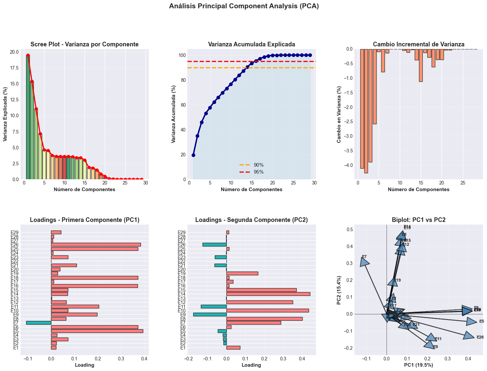
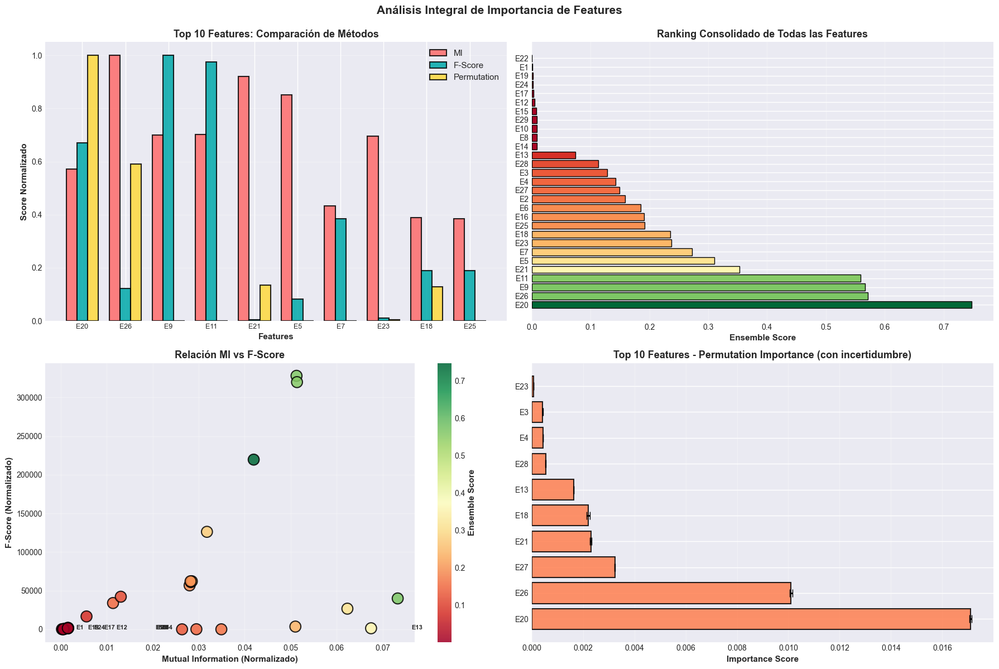
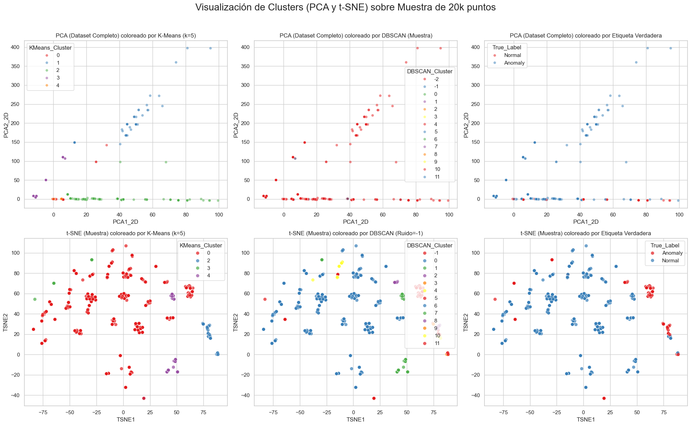

# Proyecto de Aprendizaje No Supervisado: Segmentación de Logs HDFS

Este repositorio contiene la implementación y análisis de modelos de aprendizaje no supervisado (K-means, DBSCAN, PCA y t-SNE) para la segmentación de perfiles de usuario/cliente en un entorno tecnológico, utilizando el dataset de logs HDFS.

**Miembros del Equipo:**
* JAVIER ALEJANDRO VEGA MOLINA
* SANTIAGO GERARDO SALAZAR RUIZ
* FABRICIO ARTURO BERMUDEZ ZAMBRANO
* FREDY RICARDO CRUZ SANTANA

---

## 1. Contexto del Caso

Una plataforma digital de servicios personalizados desea segmentar a sus usuarios con base en datos de navegación, transacciones y comportamiento. El equipo de analítica necesita crear perfiles representativos usando métodos no supervisados para entender mejor el comportamiento y adaptar estrategias de marketing.

Para este proyecto, simulamos este escenario utilizando el dataset HDFS, donde cada "bloque" (`BlockId`) es un "usuario" y la secuencia de eventos (E1-E29) representa su "comportamiento".

## 2. Entorno de Trabajo

Este proyecto fue desarrollado en un entorno de Python 3, utilizando las siguientes librerías principales:

* **pandas:** Para la manipulación y carga de datos.
* **numpy:** Para operaciones numéricas.
* **matplotlib & seaborn:** Para la visualización de datos.
* **scikit-learn:** Para la implementación de los modelos (StandardScaler, KMeans, DBSCAN, PCA, TSNE) y la evaluación (silhouette_score, adjusted_rand_score).

El código fuente principal se encuentra en el archivo `HDFS_Clustering.ipynb`.

## 3. Selección y Análisis del Dataset

Se utilizó el dataset HDFS, compuesto por dos archivos principales ubicados en `/dataset/preprocessed/`:

1.  **`Event_occurrence_matrix.csv`**:
    * Contiene la matriz de características. Cada fila es un `BlockId` único.
    * Las columnas `E1` a `E29` representan la frecuencia de 29 tipos de eventos diferentes para ese bloque.
    * También incluye metadatos como `Label` (Success/Fail) y `Type`.

2.  **`anomaly_label.csv`**:
    * Contiene la "verdad fundamental" (*ground truth*) para cada `BlockId`.
    * La columna `Label` (renombrada a `True_Label` en nuestro análisis) clasifica cada bloque como `Normal` o `Anomaly`.

En el **Análisis Exploratorio (EDA)**, unimos estos dos archivos. El análisis de correlación mostró algunas relaciones entre eventos, pero la alta dimensionalidad (29 características) hizo necesaria la reducción de dimensión para la visualización. La distribución de etiquetas mostró un dataset altamente desbalanceado, con muchas más instancias "Normales" que "Anómalas", lo cual es típico en la detección de anomalías.

## 4. Implementación de Modelos

El flujo de trabajo de modelado fue el siguiente:

1.  **Preprocesamiento:** Se seleccionaron las 29 columnas de eventos (E1-E29) como nuestras características (X). Estas características se escalaron usando `StandardScaler` para asegurar que todas tuvieran la misma importancia en los algoritmos basados en distancia.
2.  **K-Means:** Se utilizaron los métodos del Codo (Inercia) y la Silueta para determinar el número óptimo de clusters. Dado que el objetivo es separar "Normal" de "Anómalo", se seleccionó **k=2**.
3.  **DBSCAN:** Se implementó DBSCAN, que no requiere un número de clusters. Se ajustaron los parámetros `eps` y `min_samples` con el objetivo de que el algoritmo identificara el comportamiento "Normal" como un cluster denso (o varios) y el comportamiento "Anómalo" como "ruido" (etiqueta -1).
4.  **PCA (Análisis de Componentes Principales):** Se utilizó para reducir las 29 características a 2 componentes principales (PC1, PC2), preservando la mayor cantidad de varianza global posible.
5.  **t-SNE (t-distributed Stochastic Neighbor Embedding):** Se utilizó para reducir las 29 características a 2 dimensiones (TSNE1, TSNE2), con un enfoque en preservar las relaciones de vecindad locales (la estructura de los clusters).

## 5. Visualización de Resultados

Se generaron 6 gráficos comparativos clave (ver el Notebook):

* **PCA (K-Means vs. DBSCAN vs. Verdad)**: PCA mostró cierta superposición entre los grupos, lo que indica que una separación puramente lineal es difícil.
* **t-SNE (K-Means vs. DBSCAN vs. Verdad)**: t-SNE mostró una separación de clusters mucho más clara y definida, agrupando los puntos anómalos de manera visualmente distinta a la nube densa de puntos normales.

Además, se generaron tablas de resumen (medias por cluster) para interpretar el significado de cada grupo.

## 6. Reflexión y Conclusiones

*(Esta sección resume los hallazgos detallados en el Notebook)*

**¿Qué tipo de perfiles se pueden identificar?**

* **Perfil "Normal" (Cluster 0/1 en K-Means, Cluster 0 en DBSCAN):** Representa la gran mayoría de los bloques. Se caracteriza por un alto volumen de operaciones estándar (ej. `E3`, `E26` - servicio y almacenamiento de bloques) y una baja tasa de errores.
* **Perfil "Anómalo" (Cluster 1/0 en K-Means, Cluster -1 en DBSCAN):** Un grupo pequeño de bloques. Se caracteriza por una frecuencia significativamente mayor de eventos de error (ej. `E20`, `E21` - errores de eliminación o excepciones).

**¿Qué diferencias clave surgieron entre los modelos?**

* **K-Means** (con k=2) logró un buen trabajo al forzar una partición y aislar muchas de las anomalías en su propio cluster. Sin embargo, su naturaleza de buscar centros esféricos hizo que clasificara erróneamente algunos puntos normales que estaban en la "frontera".
* **DBSCAN** fue conceptualmente superior para este problema. Al no estar forzado a asignar cada punto a un cluster, identificó correctamente el comportamiento normal como un gran cluster denso y etiquetó a las anomalías como "ruido" (`-1`). Esto se alinea perfectamente con el objetivo de la detección de anomalías.
* **PCA vs. t-SNE:** t-SNE fue drásticamente mejor para la *visualización* de los clusters, mostrando una separación clara que PCA (lineal) no pudo capturar.

**¿Qué limitaciones encontraron y cómo las abordarían?**

1.  **Dificultad de DBSCAN en Alta Dimensión:** Encontrar el `eps` (radio) correcto para 29 dimensiones es muy difícil (maldición de la dimensionalidad).
    * *Solución:* Aplicar PCA primero para reducir a ~5-10 dimensiones antes de pasar los datos a DBSCAN, o usar algoritmos más robustos como HDBSCAN.
2.  **K-Means y Desbalanceo:** K-Means puede tener problemas con clusters de tamaños muy diferentes (como 95% vs 5%).
    * *Solución:* Usar DBSCAN o técnicas de sobremuestreo/submuestreo si el objetivo fuera un modelo supervisado. Para clustering, la identificación de ruido de DBSCAN es la mejor solución.
3.  **Interpretación de PCA/t-SNE:** Los ejes (PC1, TSNE1) no son directamente interpretables como "Eventos E5" o "Eventos E12", sino combinaciones de todos ellos.
    * *Solución:* Las visualizaciones son solo para *ver* la separación. La interpretación de los perfiles *debe* hacerse con la tabla de medias de las características *originales*.

## 7. Entregables

* **Repositorio (Este documento):** Contiene todo el código, datos y análisis.
* **Código Fuente:** `HDFS_Clustering.ipynb`
* **Datos:** `dataset/preprocessed/Event_occurrence_matrix.csv` y `dataset/preprocessed/anomaly_label.csv`
* **Documentación:** `README.md` (este archivo).
* **Presentación:** (Link a la presentación/video del equipo).